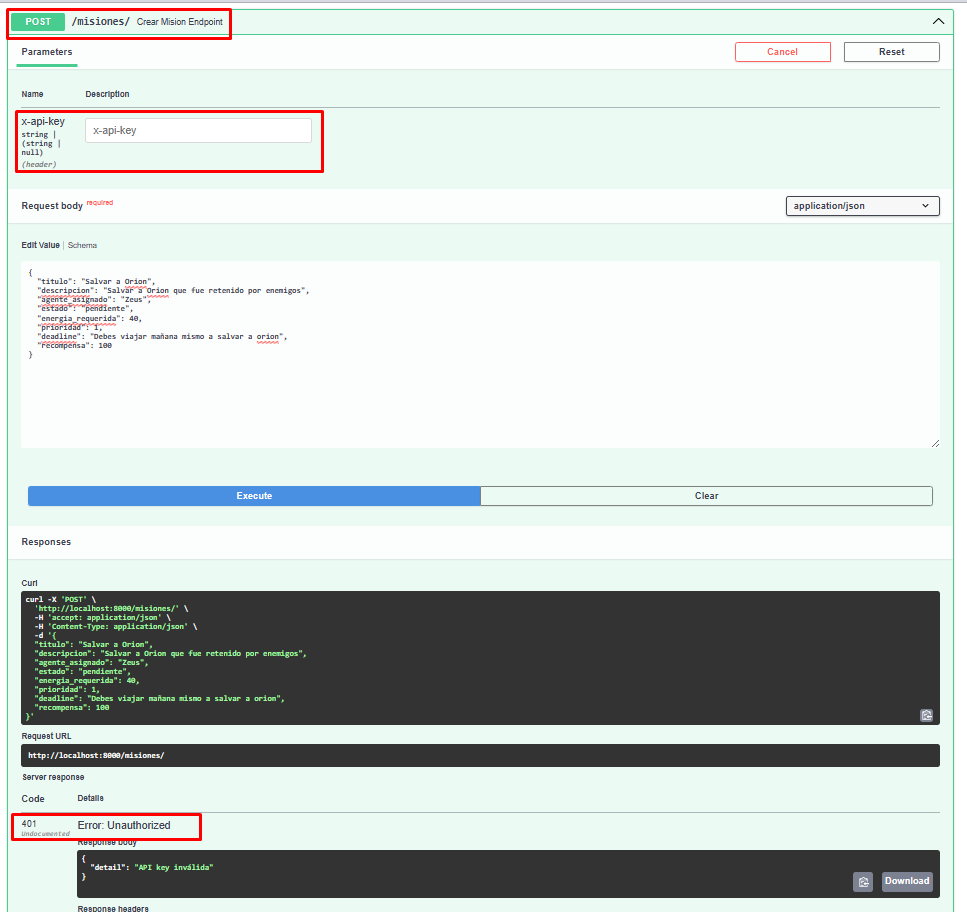
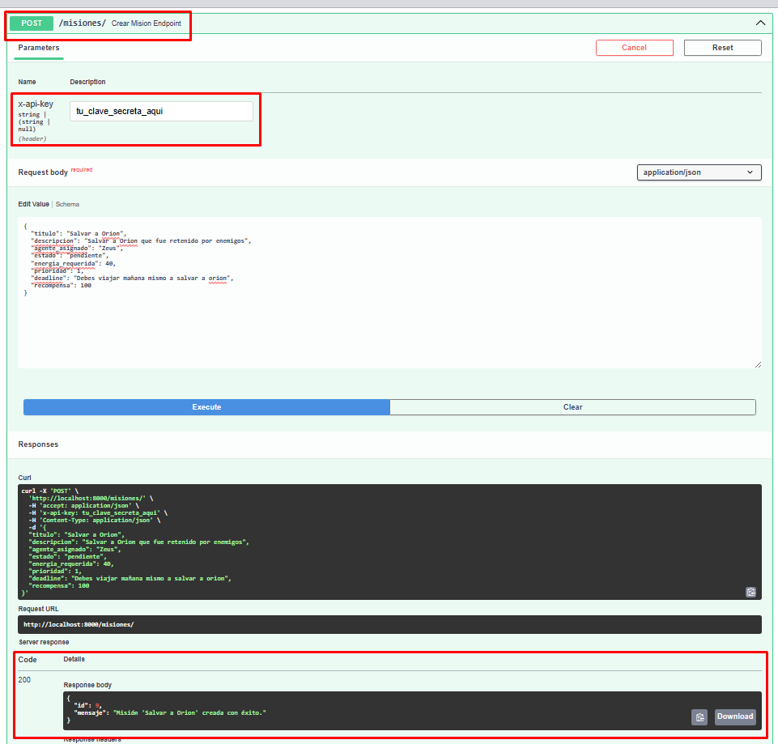
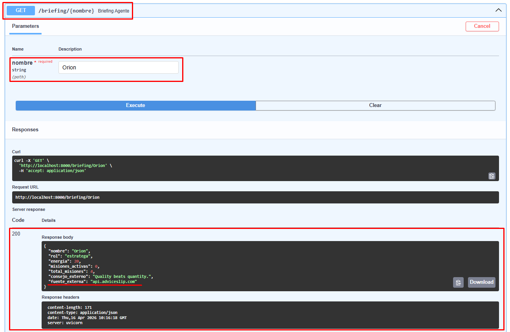

# Agencia de Agentes

Sistema para gestionar agentes autónomos con persistencia en SQLite, API REST con FastAPI,
autenticación por API key, logs estructurados e inteligencia externa. Este proyecto integra
lo aprendido en la Semana 4 (POO y herencia) con lo de la Semana 5 (SQLite y FastAPI),
y le suma cuatro áreas nuevas: autenticación, variables de entorno, logging y consumo de APIs públicas.

---

## Instalación y ejecución

### 1. Crear y activar el entorno virtual

```bash
cd Reto

# Windows
python -m venv .venv
.venv\Scripts\activate

# macOS / Linux
python3 -m venv .venv
source .venv/bin/activate
```

### 2. Instalar dependencias

```bash
pip install -r requirements.txt
```

### 3. Configurar variables de entorno

```bash
# Windows
copy .env.example .env

# macOS / Linux
cp .env.example .env
```

Abre `.env` y asigna tu clave:

```
AGENCIA_API_KEY=tu_clave_secreta
EXTERNAL_API_URL=https://api.adviceslip.com/advice
```

### 4. Levantar el servidor

```bash
uvicorn main:app --reload
```

Swagger UI disponible en: [http://localhost:8000/docs](http://localhost:8000/docs)

### 5. Ejecutar los tests

No necesitas tener el servidor corriendo. Desde la carpeta `Reto/` con el entorno virtual activo:

```bash
pytest tests/ -v
```

Salida esperada:

```
tests/test_api.py::test_crear_mision_sin_api_key_devuelve_401                PASSED
tests/test_api.py::test_briefing_retorna_estructura_con_datos_locales_y_externos_mockeados PASSED
```

Los tests no usan internet ni la base de datos real — las dependencias externas están mockeadas.

### 6. Ejecutar el cliente de demostración

En otra terminal (con el servidor corriendo y el entorno virtual activo):

```bash
python cliente.py
```

El guion ejecuta automáticamente:

1. Verifica que el servidor está activo (`GET /`)
2. Crea el agente `Orion` con autenticación (`POST /agentes/`)
3. Consulta que el agente fue creado correctamente (`GET /agente/{nombre}`)
4. Crea una misión asignada a `Orion` con autenticación (`POST /misiones/`)
5. Completa la misión — la clase descuenta energía (`POST /misiones/{id}/completar`)
6. Consulta el briefing con dato de API externa (`GET /briefing/{nombre}`)
7. Envía un mensaje y lee la bandeja (`POST /mensajes/` + `GET /mensajes/{nombre}`)
8. Demuestra que sin `X-API-KEY` se obtiene `401`

---

## Estructura del proyecto

```
Reto/
├── agente.py        — PseudoAgente y AgenteAdmin: toda la lógica de dominio vive acá
├── db.py            — Funciones SQLite para agentes, mensajes y misiones
├── main.py          — El servidor FastAPI: endpoints, autenticación, logging y API externa
├── cliente.py       — Guion de demostración que recorre el circuito completo
├── config.py        — Carga las variables del .env al arrancar
├── .env             — Tus variables reales (no se sube al repo)
├── .env.example     — Plantilla con las claves necesarias (sí se sube al repo)
├── requirements.txt — Las cuatro dependencias del proyecto
├── agentes.db       — Base de datos SQLite, se genera sola al primer arranque
└── README.md        — Este archivo
```

---

## Datos semilla

La primera vez que arranca el servidor, se insertan automáticamente estos datos
para que tengas algo con qué explorar desde el inicio. Si ya hay datos, no se toca nada.

**Agentes**

| nombre | rol | energia |
|--------|-----|---------|
| Atlas | explorador | 100 |
| Nova | admin | 150 |
| Titan | guardian | 200 |

**Misiones**

| id | título | agente | estado | energía requerida | prioridad |
|----|--------|--------|--------|:-----------------:|:---------:|
| 1 | Reconocimiento Zona Norte | Atlas | completada | 20 | 2 |
| 2 | Análisis de Artefacto | Nova | en_curso | 30 | 1 |
| 3 | Patrulla Perimetral | Titan | pendiente | 15 | 3 |

**Mensajes** (5 en total entre Atlas, Nova y Titan)

> La misión `id=1` ya viene completada — si intentas completarla de nuevo recibirás `400`.
> Usa `id=2`, `id=3` o crea una misión nueva con `POST /misiones/`.

---

## Swagger UI

FastAPI genera documentación interactiva automáticamente. Con el servidor corriendo, abre:

```
http://localhost:8000/docs
```

**Para probar un endpoint protegido:**

1. Haz clic en el endpoint que quieras probar (ej. `POST /misiones/`)
2. Clic en **"Try it out**"
3. Escribe el valor de `AGENCIA_API_KEY` de tu `.env` en el campo `x-api-key`
4. Completa el Request body y da **"Execute**"

**Sin hacer Authorize:** los endpoints protegidos responden `401 API key inválida`.

### Evidencia visual

#### (a) 401 — endpoint protegido sin key

Muestra que el sistema rechaza un request sin autenticación.
**Cómo reproducirlo:** ejecutar `POST /misiones/` en Swagger **sin** Authorize (x-api-key).


---

#### (b) 200 — mismo endpoint con key válida

Muestra que con la key correcta la misión se crea exitosamente.
**Cómo reproducirlo:** ejecutar `POST /misiones/` en Swagger **con** Authorize (x-api-key).


---

#### (c) GET /briefing/{nombre} — datos locales + API externa

Muestra la respuesta combinando datos del agente con el campo `consejo_externo` de `api.adviceslip.com`.
**Cómo reproducirlo:** ejecutar `GET /briefing/Atlas` sin autenticación.


---

## Endpoints

| Método | Ruta | Auth | Descripción |
|--------|------|:----:|-------------|
| `GET` | `/` | No | Estado del servidor |
| `GET` | `/agentes/` | No | Lista todos los agentes registrados |
| `POST` | `/agentes/` | Si | Crea un nuevo agente |
| `GET` | `/agente/{nombre}` | No | Obtiene un agente por nombre (`404` si no existe) |
| `GET` | `/agente/{nombre}/misiones` | No | Lista las misiones asignadas al agente |
| `POST` | `/mensajes/` | No | Envía un mensaje entre agentes |
| `GET` | `/mensajes/{nombre}` | No | Lee la bandeja de entrada de un agente |
| `POST` | `/misiones/` | Si | Crea una misión (`404` si el agente asignado no existe) |
| `GET` | `/misiones/{id}` | No | Obtiene una misión por id (`404` si no existe) |
| `POST` | `/misiones/{id}/completar` | Si | Completa la misión; la clase del agente descuenta la energía |
| `GET` | `/briefing/{nombre}` | No | Datos del agente + consejo de API externa (`fallback` si falla) |

> **🔐 Endpoints protegidos:** requieren el header `X-API-KEY` con el valor configurado en `.env`.
> - Header ausente o valor incorrecto → `401 API key inválida`
> - Los `GET` son públicos: consultar no modifica estado.

---

## Logs del servidor

Los registros aparecen en la terminal donde corre `uvicorn`, con el formato:

```
2026-04-16 10:23:01 | INFO    | Agente creado: nombre=Orion | rol=estratega
2026-04-16 10:23:02 | INFO    | Misión creada: id=4 | 'Infiltración' | agente=Orion
2026-04-16 10:23:03 | INFO    | Misión completada: id=4 | agente=Orion | energia_restante=95 | es_admin=False
2026-04-16 10:23:04 | WARNING | Intento de acceso con API key inválida o ausente.
2026-04-16 10:23:05 | WARNING | API externa falló para briefing de 'Orion'. Usando fallback.
```

| Nivel | Cuándo se usa |
|-------|---------------|
| `INFO` | Todo va bien: agente creado, misión completada, briefing generado |
| `WARNING` | Algo raro pero el sistema sigue: API key incorrecta, API externa caída |
| `ERROR` | Algo se rompió de verdad y necesita atención |

---

## Notas de uso

**`400` — La misión ya está completada**
Pasa si intentas completar la misión semilla con `id=1`. Usa `id=2`, `id=3` o crea una nueva con `POST /misiones/`.

**`400` — Energía insuficiente**
El agente no tiene energía suficiente para cubrir `energia_requerida`. Antes de crear misiones costosas, consulta su energía actual con `GET /agente/{nombre}`.

**`401` — API key inválida**
El header `X-API-KEY` está ausente o no coincide con el valor en `.env`. Verifica que el valor en Swagger (botón Authorize) sea exactamente el mismo que escribiste en tu `.env`.

**`404` — Agente no encontrado**
Al crear una misión, el campo `agente_asignado` debe ser el nombre exacto de un agente registrado, sensible a mayúsculas. Si escribiste `atlas` en vez de `Atlas`, no lo va a encontrar.

---

## Decisiones de Ingeniería

### 1. Esquema de la tabla `misiones`

Agregué tres columnas además del mínimo pedido en el reto:

- **`prioridad INTEGER DEFAULT 3`** (escala 1=crítica a 5=baja): me pareció importante poder ordenar la cola de trabajo de un agente por urgencia. Cuando la energía es limitada, saber qué misión es prioritaria evita gastarla en tareas de bajo impacto.
- **`deadline TEXT`**: un timestamp ISO opcional para misiones con fecha límite. Por ahora no se valida automáticamente al completar, pero la columna está ahí para que en el futuro se pueda agregar un endpoint `/misiones/urgentes` sin cambiar el esquema.
- **`recompensa INTEGER DEFAULT 0`**: energía que podría recuperar el agente al completar la misión. La guardo para una extensión futura donde completar misiones de alto riesgo reponga energía, creando decisiones estratégicas para el operador.

### 2. API pública elegida

Usé **Advice Slip API** (`https://api.adviceslip.com/advice`), que devuelve un consejo aleatorio: `{"slip": {"id": N, "advice": "texto"}}`.

Me pareció que encajaba bien con la narrativa: el endpoint `/briefing/{nombre}` simula el debrief de un agente de campo, y toda operación real termina con una lección aprendida que se lleva a la próxima misión. La API no requiere registro, no tiene límites documentados y responde rápido.

### 3. Estrategia de resiliencia frente a fallo de la API externa

Si la API externa falla — timeout después de 5 segundos, error de red o respuesta con formato inesperado — el servidor **no devuelve error ni se cuelga**. Responde con el briefing completo usando un consejo local de fallback y registra un `logger.warning` con el detalle del problema.

Elegí esta estrategia en lugar de omitir el campo o devolver 503 porque el briefing sigue siendo útil con los datos locales del agente. El campo `fuente_externa: "fallback_local"` le dice al cliente exactamente qué pasó, y el warning en los logs me permite detectar si la API está sistemáticamente caída sin que los usuarios finales se enteren.

---

## Referencias consultadas

- [FastAPI — Dependencies](https://fastapi.tiangolo.com/tutorial/dependencies/)
- [FastAPI — Header Parameters](https://fastapi.tiangolo.com/tutorial/header-params/)
- [python-dotenv — PyPI](https://pypi.org/project/python-dotenv/)
- [Python Logging HOWTO](https://docs.python.org/3/howto/logging.html)
- [Advice Slip API](https://api.adviceslip.com/)
- [Requests — Timeouts](https://requests.readthedocs.io/en/latest/user/quickstart/#timeouts)
- [SQLite3 — Python docs](https://docs.python.org/3/library/sqlite3.html)
- [Pydantic V2 — BaseModel](https://docs.pydantic.dev/latest/concepts/models/)
